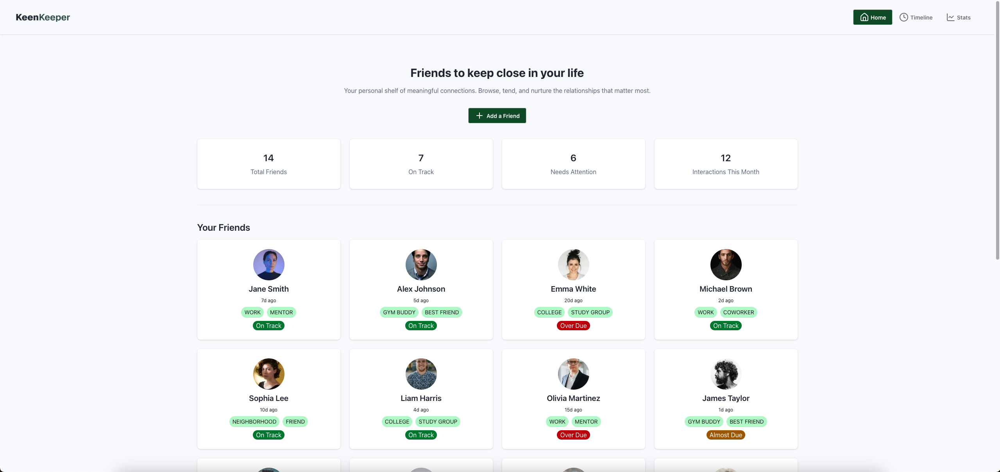
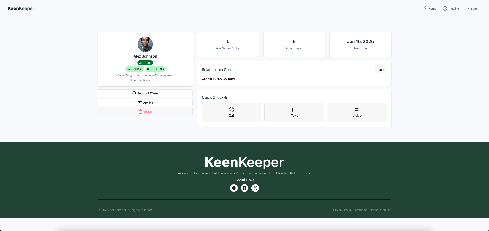
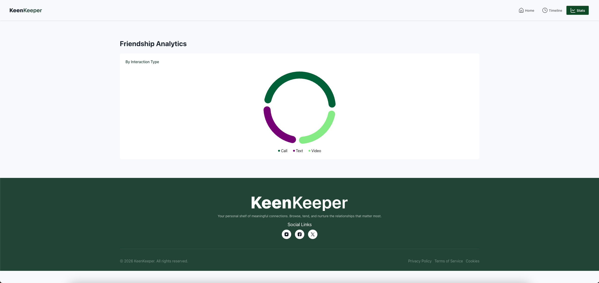

# Keen Keeper

A modern web application designed to help you maintain and strengthen your relationships by tracking meaningful interactions with friends and loved ones.

## Screenshot





## 🛠️ Technologies Used

- **Next.js 16.2.3** - React framework for server-side rendering and static site generation
- **React 19.2.4** - Modern UI library for building interactive user interfaces
- **TailwindCSS 4** - Utility-first CSS framework for rapid UI development
- **DaisyUI 5.5.19** - Component library built on Tailwind CSS for consistent design
- **Recharts 3.8.1** - Charting library for data visualization
- **Lucide React 1.3.0** - React icon library for beautiful and consistent icons
- **React Toastify 11.0.5** - Toast notifications for user feedback

## ✨ Key Features

### 1. **Friends Dashboard & Profiles**

- Comprehensive dashboard displaying all your friends
- Detailed individual friend profiles with personal information
- Interaction history and relationship insights
- Status tracking (active, overdue) based on contact frequency

### 2. **Quick Check-In System**

- Easy logging of interactions via call, text, or video
- Track days since last contact for each friend
- Set personalized contact goals and due dates
- Maintain consistent and meaningful connections

### 3. **Interactive Timeline & Statistics**

- Visual timeline of all relationship activities
- Beautiful charts showing interaction patterns by type
- Data-driven insights to help maintain connections
- Filterable timeline views for different time periods

### 4. **Friend Management**

- Add and manage friend information including bio, tags, and goals
- Categorize friends with tags (work, gym buddy, college, etc.)
- Monitor relationship health through automated status updates

## 📦 Dependencies

### Production Dependencies

- `lucide`: ^1.3.0
- `lucide-react`: ^1.3.0
- `next`: 16.2.3
- `react`: 19.2.4
- `react-dom`: 19.2.4
- `react-toastify`: ^11.0.5
- `recharts`: ^3.8.1

### Development Dependencies

- `@tailwindcss/postcss`: ^4
- `babel-plugin-react-compiler`: 1.0.0
- `daisyui`: ^5.5.19
- `eslint`: ^9
- `eslint-config-next`: 16.2.3
- `tailwindcss`: ^4

## 🚀 Installation and Running Locally

### Prerequisites

- Node.js (version 18 or higher)
- pnpm package manager

### Installation Steps

1. **Clone the repository**

   ```bash
   git clone https://github.com/rakib4kbd/B13-A7-Keen-Keeper.git
   cd B13-A7-Keen-Keeper
   ```

2. **Install dependencies**

   ```bash
   pnpm install
   ```

3. **Run the development server**

   ```bash
   pnpm dev
   ```

4. **Open your browser**
   Navigate to [http://localhost:3000](http://localhost:3000) to view the application.

### Build for Production

```bash
pnpm build
pnpm start
```

### Linting

```bash
pnpm lint
```

## 🔗 Links

- **Live Demo**: `https://b13-a7-keen-keeper.netlify.app/`
- **Repository**: `https://github.com/rakib4kbd/B13-A7-Keen-Keeper`

## 📄 License

This project is under the MIT License.
